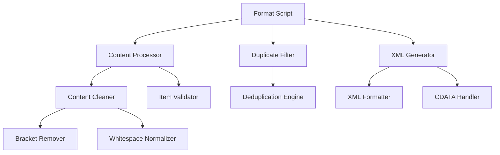

# Design Document: Format Optimization

## Overview

Cette conception vise à refactoriser et optimiser le système de formatage RSS existant pour améliorer la qualité du code, les performances et la robustesse. Le système actuel présente plusieurs problèmes : code non utilisé, nettoyage de contenu inefficace, détection de doublons basique, et gestion d'erreurs limitée.

L'approche de conception se concentre sur la séparation des responsabilités, l'optimisation des performances et l'amélioration de la maintenabilité du code.

## Architecture

Le système refactorisé suivra une architecture modulaire avec les composants suivants :



### Flux de données principal :
1. **Parsing RSS** → Analyse du XML d'entrée
2. **Content Processing** → Nettoyage et validation des éléments
3. **Duplicate Filtering** → Élimination des doublons
4. **Sorting & Limiting** → Tri par date et limitation à 500 éléments
5. **XML Generation** → Génération du XML final formaté

## Components and Interfaces

### 1. ContentProcessor
```javascript
class ContentProcessor {
  // Nettoie et valide le contenu des éléments RSS
  processItem(item)
  validateItem(item)
  cleanContent(content)
  normalizeWhitespace(text)
}
```

**Responsabilités :**
- Nettoyage des caractères parasites (crochets répétitifs)
- Normalisation des espaces
- Validation de la structure des éléments
- Échappement XML approprié

### 2. DuplicateFilter
```javascript
class DuplicateFilter {
  // Filtre les doublons avec plusieurs critères
  filterDuplicates(items)
  generateItemKey(item)
  isDuplicate(item, existingKeys)
}
```

**Responsabilités :**
- Détection basée sur guid, link et title
- Utilisation d'un Set pour performance O(1)
- Normalisation des clés de comparaison
- Préservation de l'élément le plus récent

### 3. XMLGenerator
```javascript
class XMLGenerator {
  // Génère le XML final formaté
  generateFeedXML(items, metadata)
  formatItem(item)
  formatCategories(categories)
  escapeXMLContent(content)
}
```

**Responsabilités :**
- Génération XML conforme RSS 2.0
- Formatage cohérent avec indentation
- Gestion CDATA pour descriptions
- Échappement des caractères spéciaux

### 4. ErrorHandler
```javascript
class ErrorHandler {
  // Gestion centralisée des erreurs
  handleParsingError(error, context)
  handleItemError(error, item)
  logError(error, context)
  shouldContinueProcessing(error)
}
```

**Responsabilités :**
- Gestion gracieuse des erreurs
- Logging structuré
- Décisions de continuation de traitement
- Messages d'erreur informatifs

## Data Models

### FeedItem (Enhanced)
```javascript
interface FeedItem {
  title: string;           // Titre nettoyé
  description: string;     // Description avec CDATA
  pubDate: string;        // Date RFC 822
  link: string;           // URL nettoyée
  guid: string;           // Identifiant unique
  source?: string;        // Source optionnelle
  categories: string[];   // Catégories formatées
  
  // Métadonnées de traitement
  processed: boolean;     // Indique si l'élément a été traité
  valid: boolean;         // Indique si l'élément est valide
  normalizedKey: string;  // Clé normalisée pour déduplication
}
```

### ProcessingConfig
```javascript
interface ProcessingConfig {
  maxItems: number;           // Limite d'éléments (défaut: 500)
  indentation: string;        // Indentation XML (défaut: '  ')
  collapseContent: boolean;   // Collapse XML content
  enableDeduplication: boolean; // Active la déduplication
  strictValidation: boolean;  // Validation stricte des éléments
}
```

## Correctness Properties

*Une propriété est une caractéristique ou un comportement qui doit être vrai pour toutes les exécutions valides d'un système - essentiellement, une déclaration formelle sur ce que le système devrait faire. Les propriétés servent de pont entre les spécifications lisibles par l'homme et les garanties de correction vérifiables par machine.*

### Property 1: Content Cleaning Preservation
*Pour tout* contenu d'entrée avec des artefacts de formatage (crochets répétitifs, espaces excessifs), le nettoyage doit préserver le contenu essentiel tout en supprimant les artefacts de formatage
**Validates: Requirements 2.1, 2.2, 2.4, 2.5**

### Property 2: Duplicate Detection Effectiveness
*Pour tout* ensemble d'éléments RSS avec des doublons basés sur guid, link ou title, le système de filtrage doit détecter et éliminer les doublons en préservant l'élément le plus récent
**Validates: Requirements 3.1, 3.2, 3.5**

### Property 3: XML Formatting Compliance
*Pour tout* élément RSS traité, la sortie XML générée doit être bien formée, conforme RSS 2.0, avec indentation cohérente et échappement approprié des caractères spéciaux
**Validates: Requirements 4.1, 4.2, 4.3, 4.4, 4.5**

### Property 4: Processing Limit Enforcement
*Pour tout* flux RSS d'entrée, le système ne doit jamais traiter plus de 500 éléments, même si l'entrée en contient davantage
**Validates: Requirements 5.1**

### Property 5: Error Resilience
*Pour tout* flux RSS contenant des éléments malformés ou invalides, le système doit continuer à traiter les éléments valides sans s'arrêter
**Validates: Requirements 6.1, 6.2, 6.3, 6.5**

## Error Handling

Le système d'optimisation du formatage implémentera une stratégie de gestion d'erreurs robuste :

### Stratégies de récupération :
1. **Erreurs de parsing XML** : Logging de l'erreur et tentative de récupération partielle
2. **Éléments malformés** : Saut de l'élément avec logging, continuation du traitement
3. **Erreurs de validation** : Marquage de l'élément comme invalide, exclusion du résultat final
4. **Erreurs d'E/O fichier** : Messages d'erreur clairs avec codes d'erreur spécifiques

### Logging structuré :
```javascript
{
  level: 'error|warn|info',
  component: 'ContentProcessor|DuplicateFilter|XMLGenerator',
  message: 'Description de l'erreur',
  context: { item, operation, timestamp },
  recoverable: boolean
}
```

## Testing Strategy

### Approche de test dual :
- **Tests unitaires** : Vérification d'exemples spécifiques, cas limites et conditions d'erreur
- **Tests basés sur les propriétés** : Vérification des propriétés universelles sur tous les types d'entrées

### Configuration des tests basés sur les propriétés :
- **Bibliothèque** : fast-check pour JavaScript
- **Itérations minimum** : 100 par test de propriété
- **Format de tag** : **Feature: format-optimization, Property {number}: {property_text}**

### Tests unitaires ciblés :
- Exemples spécifiques de nettoyage de contenu
- Cas limites de déduplication
- Validation de structure XML
- Gestion d'erreurs spécifiques
- Intégration entre composants

### Tests de propriétés :
- Génération de contenu RSS aléatoire avec artefacts
- Validation de préservation de contenu après nettoyage
- Tests de déduplication avec diverses combinaisons
- Validation de conformité XML sur sorties générées
- Tests de résilience avec entrées malformées

Chaque test de propriété doit référencer sa propriété de conception correspondante et valider les exigences spécifiées.